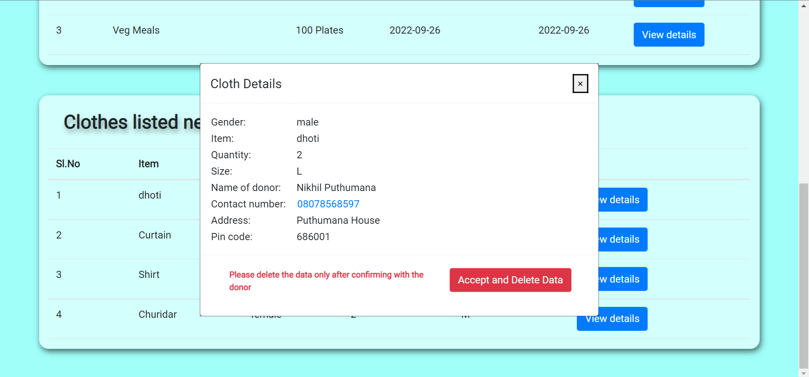

# Goodwill - a website for charity

This is a website that enables the users to donate Food items and Clothes to charity organizations.

You can view the website by clicking [here](https://nikhilputhumana.github.io/goodwill-website/) 

## 🌐 Usage

* There's a sign in button on the home page than can be used to LOGIN and SIGN UP.

* Organizations and User need to SIGN UP and LOGIN separately.

* After user login, users can donate items (Food and Clothes) by clicking the DONATE button.

* Organizations can view the items donated by the Users.

* Organizations can use these details to connect with the user and after confirming the donation to be transferred, the organization can use the Accept and Delete Data button to delete the corresponding data from the website.

## 🔖 Stacks used

* HTML
* CSS
* Javascript
* Firebase (for authentication and storage)

## 🤝 Project team members

* [Noel Varghese Oommen](https://github.com/noelvargheseoommen)
* [Linu Anil Teresa](https://github.com/linuteresa)

## Contributing
Pull requests are welcome. For major changes, please open an issue first to discuss what you would like to change.
